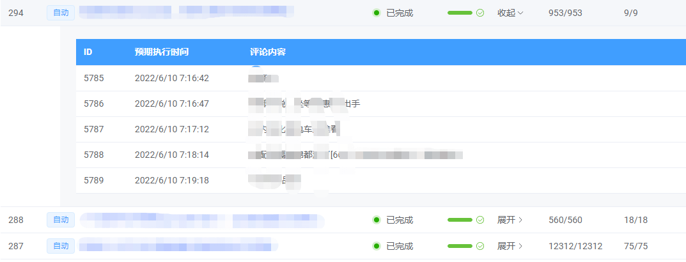

# 修改 table expand 展开行的图标



```css
:deep .el-table__body {
	.el-table__expand-column {
		.cell {
			.el-table__expand-icon {
				display: flex;
				align-items: center;
				transform: rotate(0deg);

				&::before {
					content: '展开';
					font-size: 14px;
					margin-right: 2px;
					z-index: -1;
				}

				.el-icon {
					transition: all 0.1s ease-in;
				}
			}

			.el-table__expand-icon--expanded {
				&::before {
					content: '收起';
					font-size: 14px;
					margin-right: 2px;
					z-index: -1;
				}

				.el-icon {
					transform: rotate(90deg);
				}
			}
		}
	}
}
```
