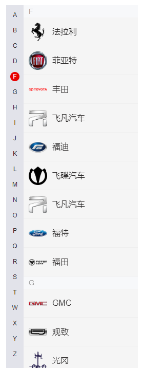

# 字母导航+品牌列表滚动定位



```html
<template>
	<div class="list-box">
		<div class="curr-index">{{ activeInitial }}</div>
		<div class="brand-list-container" ref="brandlist">
			<ul class="brand-list">
				<template v-for="item in brandList">
					<li class="initial" :class="'initial_' + item.initial">
						{{ item.initial }}
					</li>
					<li
						class="brand-item"
						:class="{active: brandId == b_item.brandId }"
						v-for="b_item in item.list"
						:key="b_item.id"
						@click="showInfo(b_item)"
					>
						<span class="logo"
							></span>
						<span class="name">{{ b_item.title }}</span>
					</li>
				</template>
			</ul>
		</div>
		<div class="letter-index-bar">
			<ul>
				<li
					v-for="item in brandList"
					:key="item.initial"
					:data-initial="item.initial"
					:class="item.initial == activeInitial ? 'act' : ''"
					@click="scrollToInitial(item.initial)"
				>
					{{ item.initial }}
				</li>
			</ul>
		</div>
	</div>
</template>
<script>
	import { getBrandCommunity } from './api.js'
	import BScroll from 'better-scroll'
	export default {
		data() {
			return {
				brandList: [],
				activeInitial: 'A',
				hooksPos: [],
				bscroll: null,
				brandId: 33, // 选中的品牌id
			}
		},
		mounted() {
			this.getList()
			// 默认进来选中第一个
			this.brandId = this.$route.query.brandId
				? this.$route.query.brandId
				: this.$store.state.brandId
			this.$store.commit('setBrandId', this.brandId)
		},
		beforeDestroy() {
			this.$store.commit('setBrandId', 33)
			this.$store.commit('setBrandName', '奥迪')
		},
		methods: {
			// 获得品牌列表
			getList() {
				getBrandCommunity().then((res) => {
					this.brandList = res.data
					this.$store.commit('setBrandList', this.brandList)
					this.$nextTick(() => {
						this.initScroll()
					})
				})
			},
			// 点击品牌,显示品牌详情
			showInfo(brand) {
				let { brandId, title, id } = brand
				this.brandId = brandId
				this.brandName = title
				this.$store.commit('setBrandId', this.brandId)
				this.$store.commit('setCommunityId', this.id)
				this.$store.commit('setBrandName', this.brandName)
				this.$emit('getBrandId', {
					brandId,
					title,
				})
				this.$router.push({
					query: {
						brandId: brandId,
					},
				})
			},
			// 点击字母
			scrollToInitial(initial) {
				this.activeInitial = initial
				let _target = '.initial_' + initial
				this.$nextTick(() => {
					this.bscroll.scrollToElement(
						document.querySelector(_target),
						300
					)
				})
			},
			// 品牌滚动
			brandScroll(pos) {
				let _scroll = Math.abs(Math.round(pos.y))
				for (let i = 0; i < this.hooksPos.length; i++) {
					let _hetght1 = this.hooksPos[i]
					let _hetght2 = this.hooksPos[i + 1]
					if (
						!_hetght2 ||
						(_scroll >= _hetght1 && _scroll < _hetght2)
					) {
						this.activeInitial = this.brandList[i].initial
						return
					}
				}
			},
			// 获取位置
			getPosArr() {
				let _items = document.querySelectorAll('.initial')
				for (let i = 0; i < _items.length; i++) {
					this.hooksPos.push(_items[i].offsetTop)
				}
			},
			initScroll() {
				this.bscroll = new BScroll(this.$refs.brandlist, {
					probeType: 3,
					mouseWheel: true,
				})
				this.bscroll.on('scroll', (pos) => {
					this.brandScroll(pos)
				})
				this.getPosArr()
			},
		},
	}
</script>
<style lang="less" scoped>
	.list-box {
		width: 100%;
		height: 100%;
		position: relative;
	}

	.curr-index {
		width: 100%;
		height: 24px;
		line-height: 24px;
		background-color: #f7f8fa;
		text-align: left;
		color: #999;
		font-size: 14px;
		padding: 0 10px;
		position: absolute;
		left: 0;
		top: 0;
		z-index: 99;
	}

	.brand-list-container {
		width: 100%;
		height: 100%;
		overflow: hidden;
		position: relative;

		.brand-list {
			width: 100%;
			height: auto;

			li.initial {
				width: 100%;
				height: 24px;
				line-height: 24px;
				background-color: #f7f8fa;
				text-align: left;
				color: #999;
				font-size: 14px;
				padding: 0 10px;
			}

			li.brand-item {
				width: 100%;
				height: 56px;
				display: flex;
				cursor: pointer;
				padding: 0 10px;
				border-bottom: 1px solid #efefef;

				.logo {
					width: 36px;
					height: 56px;
					padding: 10px 0;
					margin-right: 10px;

					img {
						width: 100%;
						height: 100%;
						object-fit: cover;
					}
				}

				.name {
					flex: 1;
					height: 56px;
					line-height: 36px;
					padding: 10px 0;
					text-align: left;
					font-size: 16px;
					color: #2b2929;
					/* border-bottom: 1px solid #efefef; */
				}
			}

			li.active {
				background-color: #fff;
				font-weight: bold;

				span.name {
					color: #409eff;
				}
			}
		}
	}

	.letter-index-bar {
		padding-top: 4px;
		width: 34px;
		height: 100%;
		position: absolute;
		left: -34px;
		top: 0;
		background-color: #e2e3ea;
		z-index: 99;

		ul {
			/* height: 70%; */
			display: flex;
			flex-direction: column;
			justify-content: space-between;
			align-items: center;
			flex: 1;

			li {
				width: 18px;
				height: 18px;
				line-height: 18px;
				text-align: center;
				color: #2b2929;
				font-size: 12px;
				cursor: pointer;
				margin: 6px 0;

				&::marker {
					content: '';
				}

				&.act {
					background-color: #e80000;
					border-radius: 9px;
					color: #ffffff;
				}
			}
		}
	}
</style>
```
