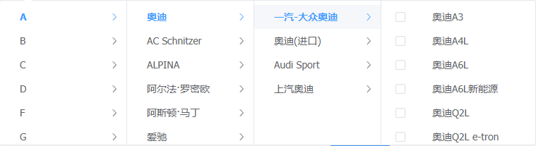

# elment-plus cascader 级联菜单异步加载数据的问题

遇到的问题:


点击奥迪的时候会请求后端接口,一次性返回3,4级数据.4级数据作为3级数据的子数据.

勾选选项的时候@change无法正常触发.

解决办法

模拟异步返回4级数据

```javascript
    props: {
        multiple: true, // 开启多选
        lazy: true, // 开启懒加载
        lazyLoad: this.lazyLoad
    }
    // 数据懒加载
    lazyLoad(node, resolve) {
        let nodes = []
        if (node.level === 2) {
            getSeriesCommunity({
                uid: parseInt(JSON.parse(sessionStorage.getItem(''))['adminId']),
                communityId: node.data.id,
            }).then(res => {
                if (res.seriesgroup && res.seriesgroup.length > 0) {
                    nodes = res.seriesgroup.map(item => {
                        item.value = item.series_group_id
                        item.label = item.series_group_name
                        item.child = item.list.map(series => { // 将要渲染的数据保存到child中,而不是children当中,留着后面模拟异步渲染
                            series.value = {
                                id: series.seriesId,
                                name: series.title
                            }
                            // series.value = series.seriesId
                            series.label = series.title
                            series.leaf = true
                            return series
                        })
                        return item
                    })
                    resolve(nodes)
                }
            })
        } else {
            setTimeout(() => {
                nodes = node.data.child; // 模拟异步返回4级数据
                resolve(nodes)
            }, 100)
        }
    },
```